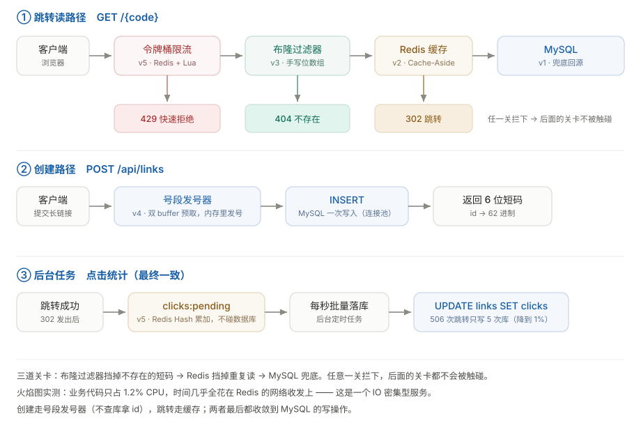
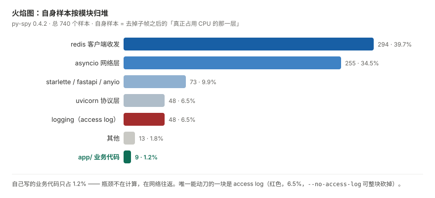

# ShortLink · 高性能短链服务

一个读多写少的高并发服务。把长链接压成 6 位短码，访问短码时 302 跳转回原网址。

**状态：v6 已完成** —— v1 → v6 六版全部落地，每一版都打了 tag。
v5 把跳转的 `302` 速率稳稳按在 **100/秒**（`RATE`），超出的请求**快速 429** 而不是把服务拖死，
点击统计补回来了、MySQL 写入量降到 **1%**（506 次跳转只写 5 次库）；
v6 用火焰图定位到真正的热点是 **Redis 的网络收发**而不是哈希计算，并顺带读出一笔
v2 留下的架构债：**同步 Redis 客户端堵住了异步事件循环**（这是下一步要修的）。

## 这个项目在做什么

| 接口 | 作用 |
|---|---|
| `POST /api/links` | 传一个长链接，返回短码和短链 |
| `GET /{code}` | 访问短码，浏览器自动跳到原始链接 |
| `GET /health` | 健康检查，部署时探活用 |

关键事实：**创建一天几万次，访问一天几千万次**。业务复杂度为零，性能复杂度拉满——
这正是它适合拿来练手的原因：每一轮优化都能在本地压出真实的 before/after 数字。

## 架构



三道关卡按「越便宜越靠前」排：先用布隆过滤器以位运算挡掉不存在的短码，再让 Redis 挡掉重复读，
MySQL 只做兜底 —— **任意一关拦下，后面的关卡都不会被触碰**。读路径上的每次命中都是
「一次 Redis 往返」；创建路径靠号段发号器**在内存里发号、不查库拿 id**；
点击统计先攒在 Redis，由后台任务每秒批量落库。

## 快速开始

**前置要求**：**Python 3.14**（本项目在这个版本上开发与压测）、**MySQL 8**、**Redis**。
MySQL 与 Redis 都必须先启动 —— 服务启动时会连它们（预热布隆过滤器），
**Redis 不在服务会直接启动失败**，没有降级。

```bash
# 1. 建库建表（两个脚本都要跑！）
mysql -u root -p < schema.sql       # 建库 shortlink + links 表
mysql -u root -p < schema_v4.sql    # 号段表 biz_segment（v4 起必需）

# 2. 建虚拟环境并装依赖
python -m venv .venv
.venv\Scripts\activate          # macOS / Linux: source .venv/bin/activate
pip install -r requirements.txt

# 3. 配置
copy .env.example .env           # 然后编辑 .env 填上 MySQL 密码

# 4. 启动
python -m uvicorn app.main:app --reload
```

打开 http://127.0.0.1:8000/docs 可以看到交互式接口文档。

> **别漏第 1 步的第二个脚本。** `biz_segment` 表只在 `schema_v4.sql` 里建，
> 而发号器是**懒加载**的 —— 漏跑它，服务照样能启动、`/health` 也返回 200，
> 但**第一次创建短链会 500**（`Table 'shortlink.biz_segment' doesn't exist`）。
> 这种「启动正常、一用就炸」最难查。

## 怎么用

服务起来之后，它就是一个"把长链接变短"的机器。三步就能跑通。

### 1. 创建一条短链

浏览器打开 <http://127.0.0.1:8000/docs>，展开 `POST /api/links` → 点 **Try it out** →
把 Request body 改成下面这行 → 点 **Execute**：

```json
{"url": "https://www.baidu.com"}
```

服务器返回：

```json
{
  "code": "000001",
  "short_url": "http://127.0.0.1:8000/000001"
}
```

`code` 是 6 位短码，`short_url` 是拼好的完整短链（前缀取自 `.env` 里的 `BASE_URL`）。

不想点鼠标就用命令行：

```bash
curl -X POST http://127.0.0.1:8000/api/links -H "Content-Type: application/json" -d "{\"url\":\"https://www.baidu.com\"}"
```

### 2. 访问短链

把 `http://127.0.0.1:8000/000001` 粘进浏览器地址栏。页面跳到百度，
**并且地址栏也从 `127.0.0.1:8000` 变成了 `www.baidu.com`** —— 这就是 302 在干活。

### 3. 查点击统计

每被访问一次，这条记录的 `clicks` 加 1：

```sql
USE shortlink;
SELECT id, code, url, clicks FROM links ORDER BY id DESC LIMIT 5;
```

### 4. 停掉服务

在跑 uvicorn 的那个窗口按 `Ctrl+C`。

> **注意**：服务默认只在 `127.0.0.1:8000` 上监听，**只有你这台机器能访问**。
> 想在同一局域网里让别人的手机打开，见下一节；想让公网上任何人访问，需要一台服务器
> （`Dockerfile` 已备好，但本项目**没有实际上云**）。其他限制见文末的「已知问题」。

## 让同一个 WiFi 的人访问

默认只监听本机。想让同一个局域网里的人（比如室友的手机）打开你的短链，三步：

```bash
# 1. 查本机的局域网 IP —— 找 IPv4 地址，形如 192.168.0.100
ipconfig

# 2. 改 .env：BASE_URL 换成这个 IP
#    不改的话，返回的 short_url 还是 127.0.0.1，别人点了打不开
#    BASE_URL=http://192.168.0.100:8000

# 3. 用 --host 0.0.0.0 启动
#    0.0.0.0 的含义是「监听所有网卡」，它不是一个能访问的地址 ——
#    要访问的是第 1 步查到的那个 IP
python -m uvicorn app.main:app --host 0.0.0.0 --port 8000
```

然后让别人在手机浏览器里打开 `http://192.168.0.100:8000/<短码>`。
第一次启动 Windows 防火墙会弹窗，选「允许访问」（专用网络即可）。

> **打不开就按这个顺序排查**：
> ① 手机是不是连的同一个 WiFi（用 4G/5G 流量不行）；
> ② 路由器是否开了「AP 隔离」（访客网络常见，同网段也互不通）；
> ③ Windows 防火墙有没有放行 8000 端口。
> 另外限流是**按 IP** 的（默认每秒 100 次），手机上连着点太快会拿到 429，停一秒就好。

## 压测

`bench.py` 是自己写的压测脚本，只用 Python 标准库（`threading` + `http.client`），
**不需要安装任何东西**。之所以不用 `wrk`：它是 Linux 工具，Windows 上没有可靠的原生版本。

```bash
# 压跳转接口：50 并发，压 15 秒
python bench.py http://127.0.0.1:8000/000001 -c 50 -d 15

# 压创建接口：--json-url 会自动切成 POST，并给每次请求生成不重复的 url
python bench.py http://127.0.0.1:8000/api/links --json-url "https://example.com/{n}" -c 20 -d 10

# 模拟「海量不存在的随机短码」攻击，用来验证布隆过滤器有没有挡住
python bench.py http://127.0.0.1:8000/000001 --random -c 50 -d 10
```

输出 QPS、P50 / P95 / P99 和状态码分布。
**压测最该看的是 P99 而不是平均值** —— 平均值会被大量快请求拉低，
用户抱怨的永远是那个最慢的。

### 实测数据：v1 → v2 → v3

同一台机器、同一份 `bench.py`、同样的 `-c 50 -d 15`，只改了"要不要走缓存"这一件事：

| 指标 | v1 无缓存 | v2 加 Redis 缓存 | 变化 |
|---|---|---|---|
| **QPS** | 44.2 | **1340.5** | **↑ 30.3 倍** |
| 平均延迟 | 1124 ms | 37.3 ms | ↓ 到 3.3% |
| P50 | 1116 ms | 36.7 ms | ↓ 到 3.3% |
| P99 | 1701 ms | 62.4 ms | ↓ 到 3.7% |
| 失败请求 | 0 | 0 | — |
| Redis 命中率 | — | **99.99%**（22716 命中 / 3 未命中） | — |

**v1 为什么这么慢**：每个请求都新建一条 MySQL 连接，还要执行一次 `UPDATE` 写点击计数。
50 个并发全部卡在"握 MySQL 的手"这一步。

**v2 做了什么**：加一层 Redis，命中就直接 302，一次数据库都不碰。
短链是典型的**读多写少**——一条短链创建一次、被访问上万次，缓存天生适合它。

**这组数字可信**：用利特尔法则验证，两次压测都把 50 条连接跑满了
（`并发数 = QPS × 平均延迟`；v1: 44.2 × 1.124 = 49.7，v2: 1340.5 × 0.0373 = 50.0）。
如果数字是虚的（比如在量空转或预热），这个乘积不会这么准。

**代价（明确写出来）**：命中缓存时点击计数不再增长 ——
2 万次压测里 `clicks` 从 1820 到 1820，**一次未变**。
这是拿"点击统计近似"换 30 倍吞吐的主动取舍，v5 用异步批量落库把它补回来。

### 实测数据：v3 布隆过滤器 vs v2 空值缓存

这一版比的不是"同一个请求更快"，而是**换一种流量**：每次都换一个**不存在**的随机短码。
空值缓存挡不住它（每个码都是新的，缓存里永远没有），所以 v2 在这里被打回原形。

| 指标 | v2 空值缓存 | v3 布隆过滤器 | 变化 |
|---|---|---|---|
| **QPS** | 64.2 | **1147.9** | **↑ 17.9 倍** |
| 平均延迟 | 774.8 ms | 43.5 ms | ↓ 到 5.6% |
| P50 | 782.9 ms | 41.8 ms | ↓ 到 5.3% |
| P99 | 966.0 ms | 91.6 ms | ↓ 到 9.5% |
| 10 秒内完成的请求 | 681 | 11508 | ↑ 16.9 倍 |
| Redis 键数（压测前 → 后） | 1 → **833** | 1 → **2** | 垃圾键消失 |
| 失败请求 | 0 | 0 | — |

**为什么 v2 在这里只剩 64 QPS**：空值缓存只能挡住"反复刷同一个不存在的码"。
每次换一个新码，缓存里永远没有它 → 全部穿透到 MySQL →
又回到 v1 那种"每个请求握一次 MySQL 的手"的状态。

**为什么 v3 能到 1147 QPS**：布隆过滤器摆在最前面，它说"不存在"就一定不存在。
请求花掉**一次 Redis 往返**就被拒，缓存查询和 MySQL 都不会被碰到。

**两张表放一起才是重点**：同一份 v2 代码，刷**存在**的短码是 1340.5 QPS，
刷**不存在**的随机短码是 64.2 QPS —— 只换了一种流量，吞吐掉 20 倍，
这就是"缓存穿透"的杀伤力。v3 之后后者变成 1147.9，**只比前者差 14%**：
「不存在的短码」从最贵的请求变成了最便宜的。

**怎么证明流量真的没到 MySQL**：压测后 `dbsize` 停在 2（`bloom:links` + `link:000001`），
而 v2 时代同样一轮压测是 1 → 833。v2 里每个不存在的短码都会走
「查库 → 库里没有 → 写一条 60 秒的空值缓存」，所以键数暴涨；
v3 连这条"查库之后才发生"的写缓存都没发生 —— 说明请求压根没走到查库那一步。

**代价**：布隆过滤器不能删元素（清零某一位会连累共享它的其它短码）。
短链若要支持删除，只能重建整个过滤器。

**这组数字同样过了利特尔法则**：1147.9 × 0.0435 = 49.9 ≈ 50 条并发，说明压测压到了饱和。

### 实测数据：v4 号段发号器 vs v3 数据库自增

这一版压的是**创建接口**（`POST /api/links`，`-c 20 -d 10`）。
v1~v3 每创建一个短链要写两次数据库（`INSERT` 拿自增 id → `UPDATE` 回写短码），
v4 改成从内存里的号段拿 id，只写一次。

| 指标 | v3 写库拿 id | v4 号段模式 | 变化 |
|---|---|---|---|
| **QPS** | 41.6 | **60.8** | ↑ 1.46 倍 |
| 平均延迟 | 479.7 ms | 328.1 ms | ↓ 到 68% |
| P99 | 661.5 ms | **471.4 ms** | ↓ 到 71% |
| 10 秒内完成的请求 | 422 | 612 | ↑ 1.45 倍 |
| **`Com_update` 增量** | **≈ 创建条数** | **+1** | **这是最硬的证据** |
| 失败请求 | 0 | 0 | — |

**为什么 `Com_update` 比 QPS 更硬**：QPS 会随机器状态飘，而 `Com_update` 是数据库自己数的
写入次数。这一轮压测实际发了 **736 个 id**，号段表只被更新了 **1** 次 ——
736 个 id 全落在同一条段 `[529, 1528]` 里，而预取要等用到 80%（第 800 个）才触发。
v3 下同样的创建量会让 `Com_update` 涨满 736 次。

**为什么 QPS 只涨 46%**：号段只省掉了「拿 id」那一次 `UPDATE`，`INSERT` 本身还在；
剩下那 328 ms 的大头是**每请求新建一条 MySQL 连接**（`app/db.py` 还没有连接池）。
**v4 治的是写放大，不是连接开销** —— 后者留给 v5。这一版真正的成绩是把数据库的写压力
从 O(N) 降到 O(1)，真实流量下这比 QPS 更值钱。

**一个容易对不上数的细节**：`MAX(id)` 会跳 736，但压测只报了 612 个请求 ——
多出来的 124 是**预热**。`bench.py` 默认先跑 2 秒预热、只把统计结果丢掉，请求照发不误。

**这组数字也过了利特尔法则**：60.8 × 0.3281 = 19.95 ≈ 20 条并发，说明压到了饱和。

### 实测数据：v5 限流 + 连接池 + 点击落库

这一版压的还是跳转接口（`-c 50 -d 10`），但**看的不再是 QPS** ——
限流生效之后，总 QPS 这个指标就失去可比性了：429 走的路比 302 还短
（一次 Redis 往返 + 一个 JSON），真正该盯的是 **`302` 的速率**。

| 指标 | 实测 | 说明 |
|---|---|---|
| 状态码 | **302: 1006 ｜ 429: 8282** | 超出速率的请求被**快速拒绝**，不是排队长等 |
| **`302` 的速率** | **1006 ÷ 10.06s = 100.0 / 秒** | **正好 = `RATE`**，这就是限流生效的判据 |
| 总 QPS | 923.5 | 含 429，**不能**用来判断限流有没有生效 |
| 失败 / 5xx | **0 / 0** | 限流 ≠ 崩溃：服务全程健康 |
| 单次 302 延迟 | **9 ~ 31 ms** | 单独发请求测的；压测那张延迟表混了 89% 的 429，不代表真实跳转体验 |

**为什么 `Com_update` 才是这一版最硬的证据**：同一轮压测放行了 **506** 次真实跳转，
而 MySQL 的 `Com_update` 只涨了 **5**（每秒一次的批量落库）。

- v1 / v2 时代：506 次跳转 = **506 次** `UPDATE links SET clicks = clicks + 1`
- v5：506 次跳转 = **5 次**批量写

**写入量降到 1%，点击数一个没丢。** 这就是 v2 那笔"用点击统计换 30 倍吞吐"的债，
在 v5 正式还清。

**代价（明确写出来）**：点击数是**最终一致**的 —— 服务被 `kill -9` 时，
最后 1 秒还没落库的增量会丢。可以接受，因为它是统计信息而不是业务数据；
换成订单或余额，这个方案就是错的。

### 实测数据：v6 火焰图 + 多 worker

v6 只问两个问题：**CPU 到底花在哪**、**worker 该开几个**。两个答案都和预期不一样。

**① 火焰图：热点不在业务代码，在 Redis 的网络收发**

740 个样本按「自身样本」归堆（`py-spy record`，20 秒，采样与压测同时进行）：



| 自身样本 | 函数 | 是什么 |
|---|---|---|
| 150 条 · 20.3% | `send (asyncio/windows_events.py)` | 把 HTTP 响应写回客户端 |
| 143 条 · 19.3% | `_read_from_socket (redis/_parsers/socket.py)` | Redis 客户端**收**响应 |
| 83 条 · 11.2% | `send_packed_command (redis/connection.py)` | Redis 客户端**发**命令 |
| 48 条 · 6.5% | uvicorn 的 access log（其中 `emit` 自身 21 条） | **比全部业务代码贵 5 倍** |
| **9 条 · 1.2%** | **`app/` 里的业务代码**（限流中间件 + 布隆 + 跳转） | —— |

`hashlib` / `md5` / `sha1` 全是 **0%** —— 「短码生成要算哈希，所以它是热点」这个直觉是错的。

> 读图注意：SVG 里每个框标的 sample 数是**累积样本**（同一条调用链上每层数字一样），
> 直接按它排序，`runpy → uvicorn.run → asyncio.run` 会整条链排到榜首。
> 要看的是**自身样本**（图上的平顶山）。

**② 顺着热点读代码：发现一笔 v2 留下的架构债**

`redis/_parsers/socket.py` 是**同步** redis 客户端的模块，而这个服务是 async 的：

- `app/main.py:47` —— `async def rate_limit()` 中间件里直接调用同步的 `limiter.allow()`：
  每个请求都要在**事件循环上同步等一次 Redis 往返**，整个进程的请求被这一行串起来排队。
- `app/main.py:90` —— `redirect_to_original` 写成了 `def`（同步路由，FastAPI 会丢进线程池），
  里面 `bloom.might_contain()` 和 `r.get()` 也都是同步 Redis，而线程池默认只有 40 条线程。

**每请求 3 次阻塞式往返**，这就是单个进程大约 500~600 QPS 就到顶的原因。
v6 最值钱的产出不是「优化了多少 QPS」，而是**能说清 QPS 为什么上不去**。

**③ worker 数：不是越大越好，Windows 上的数字更不能全信**

（2026-09-29 本机实测：`RATE` 临时调到 100000、每条压 20 秒、总并发 200）

| worker 数 | 总 QPS | 平均延迟 | P99（ms） | 备注 |
|---|---|---|---|---|
| 1 | 596.1 | 337 ms | 1016 | 基线 |
| 2 | **168 ~ 357** | 900 ~ 1800 ms | 2881 | **反而更慢，4 次复现** |
| 4 | **1135.9** | 175 ms | 495 | 1.9 倍 |
| 8 | **2482.4** | 80 ms | 133 | 4.2 倍 |

**「2 个 worker 反而比 1 个慢 3 倍」这个反常现象没能定位到根因**，但它不是噪声：
换端口、换测量顺序共测 4 次，全部复现。能确定的是这条对照 —— 把应用换成一个
**不碰 Redis / MySQL 的极简 ASGI 应用**，同样的 `--workers`：1 个 worker 4101 QPS、
2 个 worker **6347 QPS**（1.55 倍，缩放正常）。**所以问题在应用共享的外部资源那一侧，
不在 uvicorn 的进程模型上。**

另一个必须讲清楚的坑：**Windows 上的多 worker 数字只能当参考**。
uvicorn 在 Linux 上用 `fork` + 内核分发套接字，在 Windows 上要靠句柄复制把父进程的监听套接字
传给每个 worker，会引出一些 Linux 上不存在的行为：**多个 worker 会去抢同一个套接字的
`listen()`，抢输的那个在启动时报 `WinError 10022` 退出**（uvicorn 有看门狗，会立刻补一个新
worker 顶上，所以日志里会出现「Child process died」紧跟一个「Application startup complete」——
不是崩溃）；端口刚被上一个服务放开、连接还没回收干净时，这个现象更容易出现。
**要拿可靠的多进程数据，得上 Linux。**

另外一个容易忽略的测量陷阱：**并发开不够时，你测到的是压测脚本的上限，不是服务的上限。**
同一台服务，1 个客户端开 100 并发只发出 ~300 QPS，开 200 并发就能到 ~600；
而压测客户端开太多进程反而更差（4 个客户端各 100 并发只有 2005 QPS，
不如 1 个客户端 200 并发的 2246）—— 因为压测进程也在抢同一台机器的 CPU。

**④ 副产品：access log 占了 6.5% 的 CPU，而它只是个开关**

火焰图里 uvicorn 的访问日志（`emit` 那条链路）占了 6.5% 的自身样本，比全部业务代码贵 5 倍。
关掉它只加一个参数：`python -m uvicorn app.main:app --port 8000 --no-access-log`。
（本轮时间花在追上面那个反常现象上，这条的收益留给你自己压一遍对比 ——
**「火焰图提假设 → 压测给数字」的闭环，比空谈「做过性能优化」有说服力得多**。）

## 目录结构

```
shortlink/
├── app/               服务代码（按版本逐版增加模块）
│   ├── __init__.py
│   ├── config.py      配置读取（全部走环境变量）
│   ├── db.py          MySQL 连接池（v5 换成 DBUtils，get_conn() 用法未变）
│   ├── ids.py         短码生成（自增 id → 62 进制）
│   ├── main.py        FastAPI 入口与路由
│   ├── cache.py       v2：Redis 连接池与缓存键
│   ├── bloom.py       v3：手写布隆过滤器
│   ├── segment.py     v4：号段模式发号器（双 buffer）
│   ├── limiter.py     v5：令牌桶限流（Redis + Lua）
│   └── clicks.py      v5：点击计数异步批量落库
├── schema.sql         建库建表
├── schema_v4.sql      v4：号段表 biz_segment + 起点对齐
├── verify.sql         建表后的自检查询
├── practice.sql       SQL 练习（用 mysql --force 跑）
├── bench.py           零依赖压测脚本（GET / POST / 随机短码）
├── docs/
│   ├── architecture.svg            架构图（README 顶部那张）
│   └── flamegraph-self-samples.svg 火焰图自身样本归堆（v6）
├── Dockerfile         容器化：python:3.14-slim，非 reload，CMD 带 --workers
├── .dockerignore      挡掉 .venv / .env，别让密码进镜像、别让上下文白传几百兆
├── requirements.txt
├── TROUBLESHOOTING.md 踩坑记录：24 个真实报错的根因与修法
├── TROUBLESHOOTING.html  踩坑记录的排版网页版（封面 + 可点目录）
├── .env.example       配置模板，复制成 .env 再填密码
└── .gitignore
```

> 路线图上的模块到 v6 已全部落地（`app/` 下共 9 个文件）。

## 技术选型说明

- **FastAPI**：异步、自动生成 OpenAPI 文档（`/docs`），演示和截图方便
- **PyMySQL 而不是 ORM**：SQL 必须自己写。索引、慢查询、执行计划是面试重点，
  用 ORM 自动生成会把这些全部藏起来，你就失去了所有能聊的东西
- **302 而不是 301**：301 会被浏览器永久缓存，第二次点击不经过服务器，点击统计全丢

## 演进路线

- [x] **v1** 最小闭环：创建 + 跳转
- [x] **v2** 缓存加速：Redis + Cache-Aside，**读 QPS 44.2 → 1340.5（30 倍）**
- [x] **v3** 防穿透：手写布隆过滤器，**随机短码压测 64.2 → 1147.9 QPS（17.9 倍）**
- [x] **v4** 发号器重构：数据库自增改号段模式 + 双 buffer 预取，**创建接口 `Com_update` 从 O(N) 降到 O(1)**
- [x] **v5** 稳定性：令牌桶限流（Redis + Lua）、DBUtils 连接池、点击计数异步落库，**写库量降到 1%**
- [x] **v6** 上线调优：py-spy 火焰图定位热点（**热点是 Redis 网络收发，不是哈希**）、
      多 worker 对照实测（**发现 `--workers 2` 反而更慢，并把根因缩到「同步 Redis 客户端」**）、
      Dockerfile + .dockerignore（本机没装 Docker，只交付文件）

## 已知问题（故意的，留给后面解决）

- **`/health` 也会经过限流中间件，所以它其实依赖 Redis** —— 中间件用 `@app.middleware("http")`
  注册，对**所有**路由生效，健康检查也要走一次 `limiter.allow()`。
  Redis 抖动时它会失败，部署编排可能因此误判「进程死了」并反复重启容器，**把故障放大**。
  修法：在中间件里放行 `/health`（或把限流改成路由级依赖）
- **`app/cache.py` 用的是同步 redis 客户端，却混在 async 服务里** —— 每请求 3 次阻塞式往返，
  其中 `limiter.allow()` 直接堵在事件循环上（`app/main.py:47`）。这是单进程 ~500 QPS 就到顶的原因，
  也是「加 worker 收益不如预期」的第一嫌疑人。**v7 第一件事：换 `redis.asyncio` + 把中间件里的调用 await 起来**
- **`--workers 2` 在本机（Windows 11 + uvicorn 0.53）反而比单 worker 慢 3 倍**，4 次复现，根因未定位。
  对照实验已排除 uvicorn 的进程模型（换极简应用后 2 worker 能快 1.55 倍），
  怀疑与同步客户端 + 共享外部资源有关。**留到 Linux 上复测**
- 点击数是**最终一致**的 —— 服务被 `kill -9` 时最后 1 秒的增量会丢。
  统计信息可以近似，订单和余额不行（v5 的取舍）
- 限流值 `RATE=100` 是**拍的，不是算的** —— 正确做法是先压出无保护下的最大 QPS，
  再取它的 70%~80%。这个值应该来自实测（v5 的取舍）
- 限流按 **IP** 而不是按短码 —— 挡得住单个来源的滥用，挡不住换 IP 的分布式刷
- 短码有规律、可枚举 —— v4 只换了**发号方式**（自增 → 号段），没有换**编码方式**，
  短码仍然连号可猜。要彻底解决得打乱字母表或换成不连续 id（本项目不做，留作面试延伸话题）
- id 有空洞 —— 号段模式换来的：服务重启会丢掉没用完的半段，这是主动取舍不是 bug

## 踩坑记录

开发全过程中实际撞到的 **24 个问题**（v1 段 18 个 + v2 段 4 个 + v3 段 2 个）。每一条都记录了当时的报错原文、
根因、修法，以及"下次怎么避免"。文末还有一节专门讲**这些坑怎么用在面试里**。

→ **[TROUBLESHOOTING.md](TROUBLESHOOTING.md)**（另有排版网页版 [TROUBLESHOOTING.html](TROUBLESHOOTING.html)）

里面最值得一看的是**短码生成器被 MySQL 默认 collation 从 62 进制悄悄变成 36 进制**那一条：
它只在第 36 条创建之后才暴露，单元测试永远抓不到。
